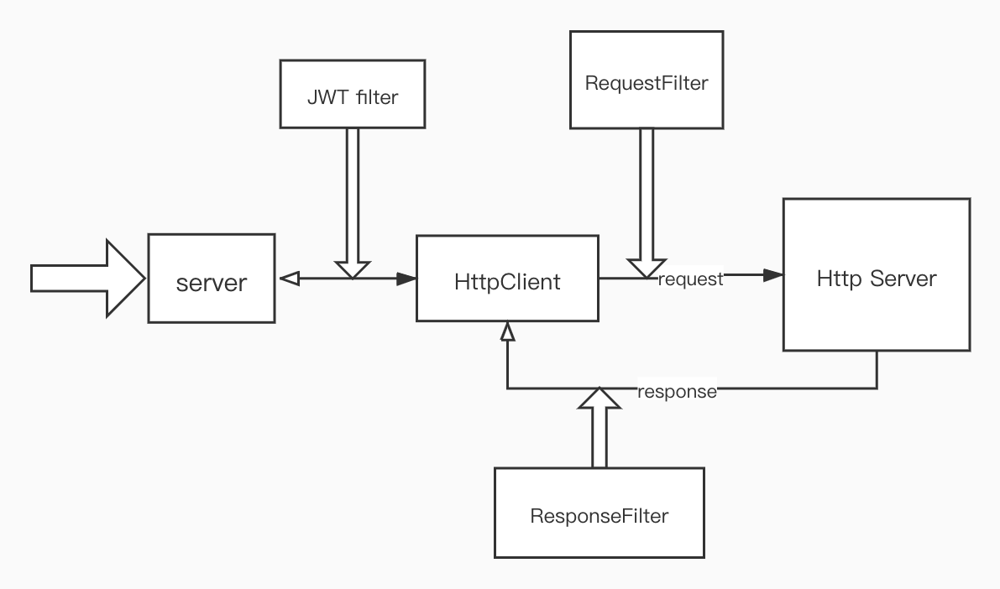

## Mini Gate - an api gateway based on netty

Mini Gate 是一个基于Netty实现的轻量级API网关。

### 已实现功能
- HTTP转发：支持GET、POST方法，POST方法的请求体支持`json`和`x-www-form-urlencoded`格式。
- 负载均衡：支持随机、轮询算法
- 权限验证：支持JWT权限验证

### 设计思路
Mini Gate分为`server`、`client`、`router`、`filter`四个主要部分。
其中，`server`负责请求的接收和返回；
`client`负责向真实服务发送请求和接收响应；
`router`负责路由；
`filter`负责对两个请求和两个响应进行过滤，可以实现特定功能（比如日志、链路追踪、度量、设置Header等等）

架构图如下：

